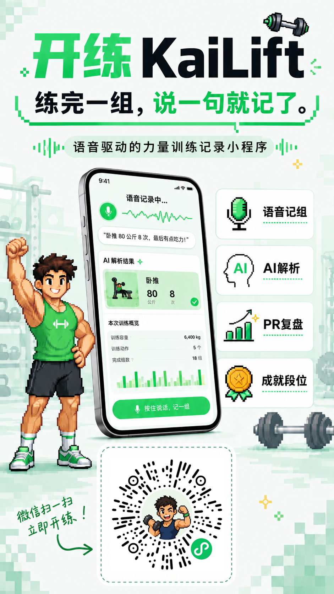

# 开练 KaiLift 小程序

开练 KaiLift 是一个语音驱动的力量训练记录微信小程序。核心体验是「练完一组，说一句就记了」：训练中长按说话，后端自动完成语音转写、动作/重量/次数解析、训练组入库，并在训练结束后生成 PR、容量、成就段位和分享图。

## 体验

微信扫码体验：



个人网站项目卡片：[https://www.chenyi.uno/index.html#capabilities](https://www.chenyi.uno/index.html#capabilities)

## 功能

- 语音记组：支持自然语言输入训练动作、重量、次数和备注。
- AI 解析：将语音/文本解析成结构化训练组，并支持确认和修正。
- 训练闭环：首页、训练页、动作库、训练详情、数据页、个人页和成就墙。
- PR 复盘：记录动作级 PR、历史曲线、训练容量和月度热力图。
- 成就段位：按训练行为解锁徽章、经验值和段位。
- 分享图：生成训练总结海报，并附带可扫码打开的小程序码。

## 技术栈

- 微信小程序原生框架
- JavaScript / WXML / WXSS
- 自定义 TabBar 与组件化页面
- REST API：`https://kailift.chenyi.uno`
- 后端仓库：[CY-CPU1011/KaiLift](https://github.com/CY-CPU1011/KaiLift)

## 目录结构

```text
miniprogram/              小程序页面、组件、工具函数和静态资源
docs/                     产品、设计和对接文档
tests/                    回归测试
api.json                  后端 REST API 快照
project.config.json       微信开发者工具项目配置
```

历史云函数代码已迁移到 REST 后端并从当前仓库删除；如需追溯可查看 Git 历史。

## 本地开发

1. 使用微信开发者工具打开本仓库根目录。
2. 确认 `project.config.json` 中的 AppID 与你的小程序一致。
3. 默认接口地址在 `miniprogram/utils/constants.js`，当前指向线上 REST 服务。
4. 本仓库不包含 `.env.local`、数据库连接串、AppSecret、AI Key 或腾讯云密钥。

开发者工具模拟器会生成本地 `dev_` 测试 openid；真机、体验版和正式版走 `wx.login`，由后端通过微信 `code2session` 换取真实 openid。

## 安全说明

- `.env.local`、`project.private.config.json`、上传/预览产物和依赖目录已加入 `.gitignore`。
- 小程序 AppID 不是密钥，可以出现在 `project.config.json` 中。
- AppSecret、数据库连接串、DeepSeek/Tencent Key 只应配置在后端或本地环境变量中，不应提交到仓库。
